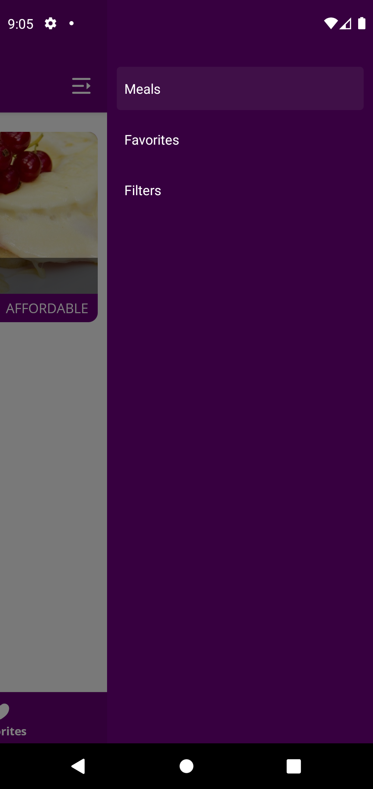
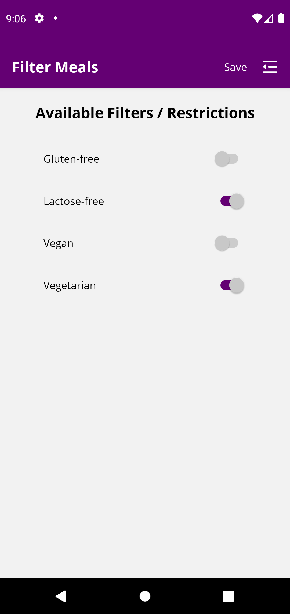

# recipry
Recipry is a react native based food recipes application.

## *Purpose*
:bangbang: *The purpose of this project is to learn how to integrate multiple navigators inside a single parent and how to integrate those navigators with redux* :bangbang:

## Few features
- For navigation, this app is using *four* different navigators provided by the [React Navigation](https://reactnavigation.org/docs/getting-started/) library
  - **Stack Navigator**,
  - **Bottom Tabs Navigator** (for *iOS*),
  - **Material Bottom Tabs Navigator** (for *Android*), and
  - **Drawer Navigator**.
- Data flow between different screens through different these navigator options.
- Different tab and header color according to the current route.
- Cool color change algorithm for meal categories that allows user to see different color tiles every time they open the app.
- Allow user to add recipe in their favorites section.
- User can select few filters and meals are displayed to the user according to his/her filter selection.
- This app is using the **Open Sans** font for all the text.
- For state management, this app has been integrated with **Redux** using [Redux Toolkit](https://redux-toolkit.js.org/).

## Technologies
- React Native 
- Expo CLI 
- React Navigation 
- Redux Toolkit 

## App screens
| Home screen | Favorites screen | Favorite Meal Details screen | Side Drawer | Filters screen |
| ----------- | ------------ | -------------------------------- | ----------- | -------------- |
|  |  |  |  |  |

| Meals screen | Meals Details screen |
| ------------ | -------------------- |
|  |  |
